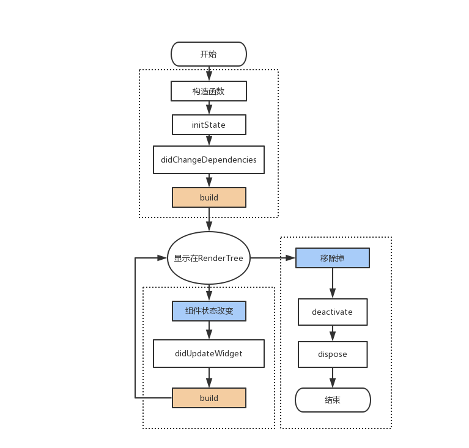

## State的生命周期

## 方法介绍

**initState**

> 插入渲染树时调用，只调用一次，widget创建执行的第一个方法，可以再里面初始化一些数据，以及绑定控制器

**didChangeDependencies**

> 当State对象的依赖发生变化时会被调用；
> 例如：在之前build() 中包含了一个InheritedWidget，然后在之后的build() 中InheritedWidget发生了变化，那么此时InheritedWidget的子widget的didChangeDependencies()回调都会被调用。InheritedWidget这个widget可以由父控件向子控件共享数据，案例可以参考 scoped_model开源库。

**build**

> 它主要是用于构建Widget子树的，调用次数：多次，初始化之后开始绘制界面，当setState触发的时候会再次被调用

**didUpdateWidget**

> 组件状态改变时候调用，可能会调用多次

**deactivate**

> 当 State 被暂时从视图树中移除时，会调用这个函数。
页面切换时，也会调用它，因为此时 State 在视图树中的位置发生了变化，需要先暂时移除后添加。

**dispose**

> 当State对象从树中被永久移除时调用；通常在此回调中释放资源。

**reassemble**

> 此回调是专门为了开发调试而提供的，在热重载(hot reload)时会被调用，此回调在Release模式下永远不会被调用。

总结

|  阶段   | 调用次数  |
|  :----  | ----:  |
| 构造函数  | 1 |
| initState |	1 |
| didChangeDependencies |	>=1 |
| didUpdateWidget |	>=1 |
| deactivate	| >=1 |
| dispose |	1 |